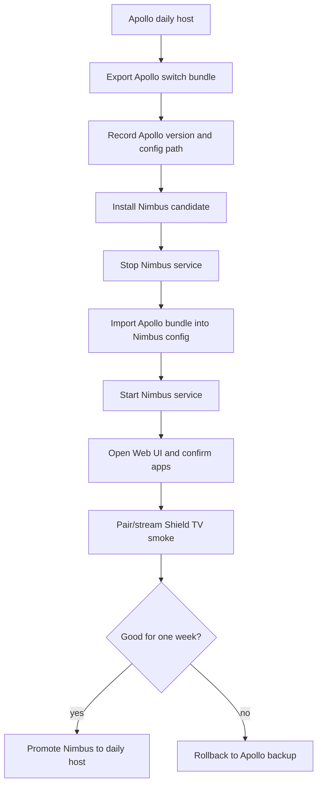

# Apollo To Nimbus Switch Guide

Snapshot date: 2026-05-24

This guide is for maintainers and early testers who already use Apollo and want
to try Nimbus without losing apps, Web UI credentials, paired clients, covers,
or configuration history.

Nimbus is still in alpha-prep. Do not run the first switch attempt on a
daily-use host unless you have a rollback path.

## What Can Be Carried Over

Apollo, Vibepollo, and Nimbus share the same inherited configuration shape for
the first Nimbus alpha:

| Item | Usually stored in | Why it matters |
| --- | --- | --- |
| Apps | `apps.json` | Custom apps, Playnite-synced entries, images, launch commands. |
| Host settings | `sunshine.conf` | Display, encoder, audio, network, Playnite, RTSS, and app behavior. |
| Web UI users and state | `sunshine_state.json` | Web UI credentials, paired-client state, and host state. |
| Compatibility state | `vibeshine_state.json` | Vibepollo-era state if present. |
| Client certificates and keys | `credentials/` | Pairing identity and HTTPS/GameStream certificates. |
| Covers | `covers/` | App artwork referenced by `apps.json`. |

The switch bundle may contain password hashes, private keys, client
certificates, and device identity data. Treat it as sensitive.

## Current Installer Reality

The Nimbus installer can detect Apollo and uninstall it before installing
Nimbus. That is required because the projects share inherited service and
upgrade identity.

However, MSI-style Apollo to Nimbus config carry-over is not yet a proven
automatic migration. A safe alpha switch should create a separate Apollo config
bundle first, then import it into Nimbus only after the new install is present
and the Nimbus service is stopped.

## Recommended Switch Flow



## Export Apollo Config

Run this from an elevated PowerShell window before uninstalling Apollo:

```powershell
powershell -ExecutionPolicy Bypass -File .\scripts\collect_apollo_switch_bundle.ps1
```

The script looks for Apollo in the registry and common install/config paths. It
writes a timestamped bundle under `nimbus-switch-bundles/` with:

- `config/`: copied Apollo config files and folders.
- `switch-bundle-summary.md`: human-readable summary.
- `switch-bundle-manifest.json`: file inventory and SHA256 hashes.

If Apollo uses a non-standard config path, pass it explicitly:

```powershell
powershell -ExecutionPolicy Bypass -File .\scripts\collect_apollo_switch_bundle.ps1 `
  -SourceConfigDir "C:\Program Files\Apollo\config"
```

## Import Into Nimbus

After installing Nimbus, stop the service before importing:

```powershell
Stop-Service ApolloService -ErrorAction SilentlyContinue
```

Then import from the Apollo source or exported bundle config into Nimbus:

```powershell
powershell -ExecutionPolicy Bypass -File .\scripts\collect_apollo_switch_bundle.ps1 `
  -SourceConfigDir ".\nimbus-switch-bundles\<timestamp>-apollo-to-nimbus\config" `
  -NimbusConfigDir "C:\Program Files\Nimbus\config" `
  -ImportToNimbus `
  -Force
```

Restart Nimbus:

```powershell
Start-Service ApolloService
```

`-Force` allows known config files and folders in the Nimbus config directory to
be replaced. The script backs up existing Nimbus copies into the same switch
bundle before replacement.

## What To Check After Import

- Web UI opens at `https://localhost:47990`.
- Apps page contains your expected Apollo apps.
- Covers load or fail gracefully.
- Clients page shows expected paired devices, or pairing still works if you
  intentionally skipped credentials.
- Shield TV / Artemis can pair, start a short stream, and disconnect cleanly.
- General display, virtual display, HDR, audio, and Playnite settings still look
  sane.

## Rollback

If Nimbus is not ready:

1. Export the current Nimbus config with the same switch script.
2. Uninstall Nimbus without factory reset unless you intentionally want to wipe
   its config.
3. Reinstall Apollo.
4. Restore the saved Apollo bundle into Apollo's config directory.
5. Start Apollo and verify apps, clients, and streaming.

Do not delete the original Apollo switch bundle until Nimbus has been your
daily host for at least a week.

## Release Gate

The first Nimbus alpha should not claim seamless Apollo migration until this
flow has been tested on a physical host:

- Apollo installed and working.
- Apollo switch bundle exported.
- Nimbus installed over or after Apollo.
- Apollo bundle imported into Nimbus.
- Apps, settings, credentials, pairing, stream start, and disconnect verified.
- Rollback path recorded.
