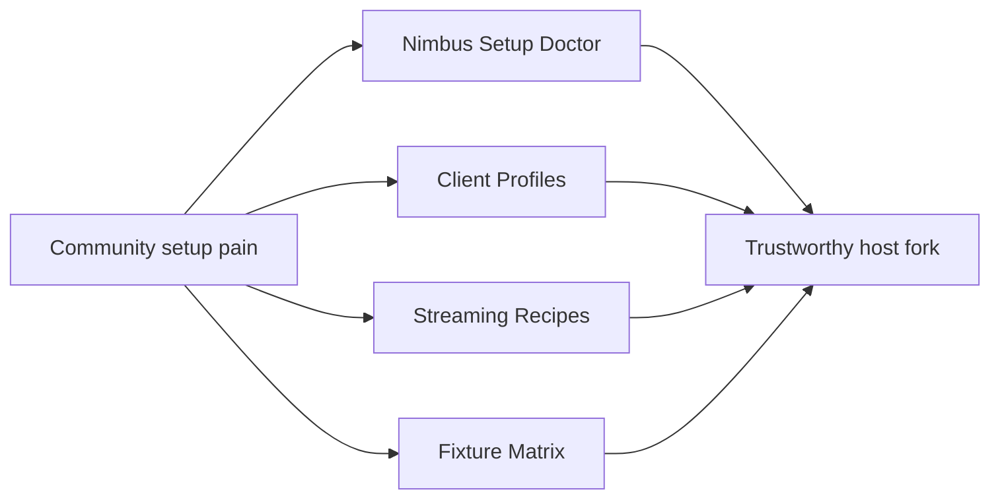
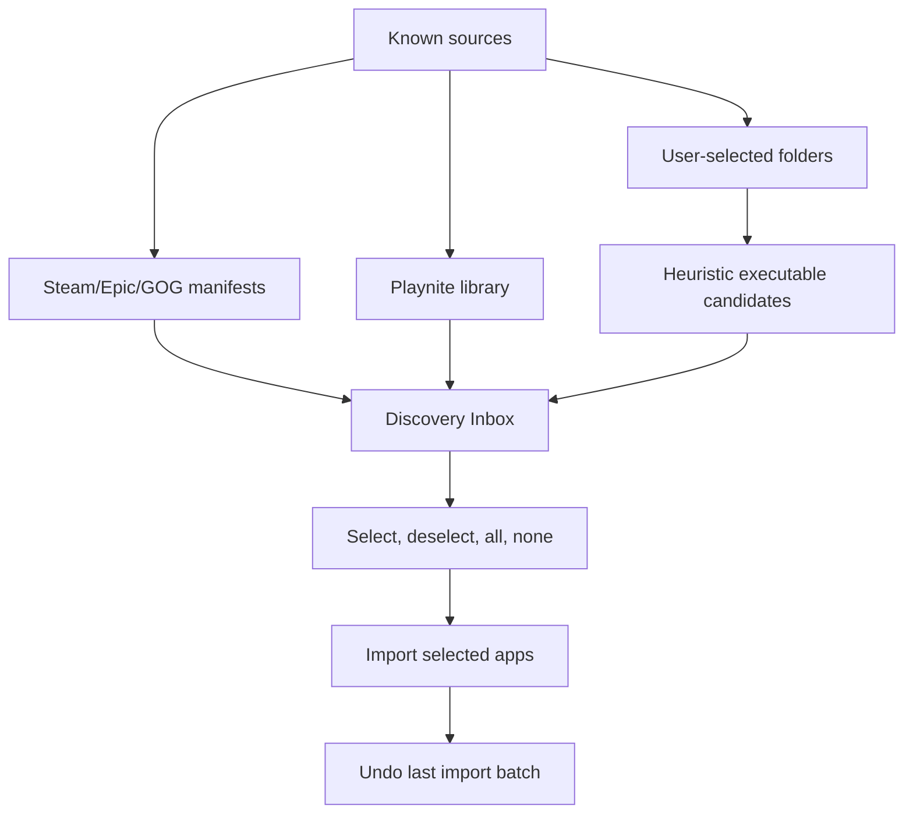

# Nimbus Community Research

Snapshot date: 2026-05-23

This document turns community setup patterns into Nimbus product direction. It
is not a promise that Nimbus will replace every upstream feature. The goal is to
identify where Nimbus can be meaningfully different from Vibepollo, Apollo, and
Sunshine while staying useful to Moonlight-compatible clients.

## Positioning

Nimbus should become the guided, validated, profile-driven host fork:

> Tell Nimbus what you stream to, and Nimbus tells you the correct display,
> bitrate, audio, controller, and network setup. If something is wrong, Nimbus
> explains why.

That is different from simply adding more power-user toggles. Vibepollo already
leans into fast feature expansion around Playnite, RTSS/NVIDIA Control Panel,
WGC/frame-generation workarounds, Lossless Scaling, WebRTC, API tokens, and
session auth. Nimbus can stand out by making the messy community setup ritual
inspectable, repeatable, and easier to support.

## Observed Setup Clusters

| Cluster | Typical Shape | Nimbus Opportunity |
| --- | --- | --- |
| Living-room console | Windows host to Shield TV, Android TV, Xbox, or mini PC at 4K60/4K120 | Presets for TV clients, controller-first apps, and safe cursor handling. |
| Handheld | Steam Deck, phones, tablets, Logitech G Cloud, 720p/800p/1200p/90Hz | Device profiles and bitrate/refresh recommendations. |
| OLED/HDR enthusiast | 4K120 HDR, dummy plugs, virtual displays, AV1/HEVC, EDID tuning | HDR/display doctor and validated 10-bit/HDR checks. |
| Headless host | No monitor, SudoVDA/VDD, dummy HDMI/DP, VM/GPU passthrough | Virtual-display lifecycle diagnostics and recovery warnings. |
| Remote home/cloud | Tailscale, WireGuard, ZeroTier, WAN pairing, mobile networks | Network path diagnostics and support boundaries. |
| Library launcher | Playnite, Steam Big Picture, LaunchBox, emulators, Xbox/Game Pass | Library integration status, import safety, and clean launch/exit guidance. |
| Performance tuning | RTSS frame caps, fractional refresh, WGC/DXGI, Lossless Scaling | Frame pacing assistant with observable reasons. |
| Family/local multiplayer | Multiple controllers on Android TV/Shield/Google TV | Controller doctor and Player 1 conflict checks. |

## Repeated Pain Points

### Display And HDR

Users often bounce between SudoVDA, MikeTheTech VDD, dummy plugs, physical
monitors, EDID exports, HDR calibration, and app-specific display overrides.
The real pain is not only whether a setting exists, but whether the user knows
which display Nimbus is capturing, which display was changed, and whether the
restore path is trustworthy.

### Frame Pacing

Frame pacing advice is scattered across wikis and forum comments: 59.94 vs 60,
119.88 vs 120, RTSS caps, WGC vs DXGI behavior, VRR/G-Sync, Wi-Fi power-saving,
and client-native refresh. Nimbus should surface this as a guided check instead
of leaving users to infer it from symptoms.

### Audio

Stereo, 5.1, 7.1, Steam Streaming Speakers, virtual sinks, eARC/soundbars,
Bluetooth delay, and app-specific routing are recurring support traps. Nimbus
should make audio mode, selected sink, and likely downmix paths easier to see.

### Controllers

ViGEmBus, host-attached physical controllers, player-order conflicts, multiple
controllers collapsing into one, Android TV mappings, Steam Input, and DualSense
features all create confusing failures. Nimbus needs a controller health view
before it needs more hidden input knobs.

### Cursor Persistence

The Windows cursor can remain visible, disappear, duplicate, offset, or be
confused with the client-side cursor. This appears across host/client streaming
stacks, especially with desktop mode, touchscreen/touchpad mode, Android
clients, HDR/virtual displays, and games that draw their own cursor.

Nimbus should start with diagnostics and safe workarounds:

- Explain the difference between host cursor, client cursor, and game cursor.
- Link to client-side cursor toggles where applicable.
- Offer per-app guidance for controller-first games.
- Consider a low-risk "move cursor to safe corner on launch" policy before any
  invasive cursor-hiding behavior.

### Network

Users can often say "Tailscale works" or "stream failed," but not whether they
are direct, relayed, firewalled, blocked by RTSP, or using the wrong address.
Nimbus should eventually report network path hints, open ports, and support
boundaries for overlay networks.

### Install And Update Trust

Unsigned installers, UAC, driver installation, archived ViGEmBus status,
SudoVDA, service identity, and inherited project names affect trust. Nimbus
should keep release notes honest and make rollback/update behavior predictable.

## What Existing Projects Already Cover

| Project | Useful Coverage | Nimbus Lesson |
| --- | --- | --- |
| Sunshine | Cross-platform host, mature configuration docs, apps, network setup, audio/input knobs. | Do not duplicate docs blindly; add guided diagnostics around the knobs. |
| Apollo | SudoVDA-oriented virtual display, Artemis workflow, display override docs, stutter guidance. | Virtual display and frame pacing are primary host responsibilities. |
| Vibepollo | Playnite sync, RTSS/NVCP integration, WGC/frame-generation fixes, Lossless Scaling, WebRTC, scoped API tokens, session auth, update checks. | Avoid chasing every power-user toggle; focus on setup intelligence and validation. |
| Moonlight/Artemis | Client settings, controller behavior, native FPS, HDR, cursor toggles, platform-specific quirks. | Nimbus should stay compatible and explain client-side fixes without pretending Lucent exists yet. |
| Playnite | Library plugins, emulator auto-scan, metadata, covers, categories, exclusions. | Prefer Playnite for library truth; add a safer Discovery Inbox for non-Playnite users later. |

## Feature Ranking

| Rank | Feature | Impact | Effort | Risk | First Deliverable |
| ---: | --- | --- | --- | --- | --- |
| 1 | Nimbus Setup Doctor | Very high | Medium | Low | Read-only health report with display, encoder, driver, ports, logs, and warnings. |
| 2 | Client Profiles | Very high | Medium | Medium | Preset docs and UI labels for Shield TV, Steam Deck, Android TV, phone/tablet, mini PC. |
| 3 | Pairing deep-link UX | High | Low | Low | Toast opens Clients page at Pair Client section and focuses the PIN flow. |
| 4 | Streaming Recipe Library | High | Low | Low | Markdown recipes for common setups with known-good defaults. |
| 5 | Frame Pacing Assistant | High | Medium | Medium | Detect requested FPS vs display refresh and recommend safe caps. |
| 6 | Audio Routing Wizard | High | Medium | Low | Show selected sink, channel mode, and common downmix checks. |
| 7 | Controller Doctor | High | Medium | Low | Show ViGEm status, host controller warning, and multi-controller notes. |
| 8 | Safe Update/Rollback Channel | Medium-high | Medium | Low | Release channel docs, rollback notes, and service/driver preservation checks. |
| 9 | Game Discovery Inbox | Medium-high | Medium | Medium | Read-only candidate list before any import writes to `apps.json`. |
| 10 | Community Fixture Matrix | Medium | Low-medium | Low | Public table of tested host/client/display/network combos. |

## Game Discovery Inbox

Vibepollo already covers a large Playnite-based import path. Nimbus should not
blindly scan every `.exe` and add false positives. The safer Nimbus version is a
review inbox:

Candidate confidence should be explicit:

- `High`: launcher manifest or Playnite entry with install metadata.
- `Medium`: known game folder pattern with one likely executable.
- `Low`: directory heuristic with multiple executables or launchers.

The first implementation should be read-only and write no apps until the UI and
candidate scoring are reviewed.

## Sources

- [Vibepollo README](https://github.com/Nonary/Vibepollo)
- [Sunshine configuration docs](https://docs.lizardbyte.dev/projects/sunshine/master/md_docs_2configuration.html?lng=en-US)
- [Moonlight Setup Guide](https://github.com/moonlight-stream/moonlight-docs/wiki/Setup-Guide)
- [Moonlight Android releases](https://github.com/moonlight-stream/moonlight-android/releases)
- [Apollo README](https://github.com/ClassicOldSong/Apollo)
- [Apollo Display Mode Override](https://github.com/ClassicOldSong/Apollo/wiki/Display-Mode-Override)
- [Apollo Stuttering Clinic](https://github.com/ClassicOldSong/Apollo/wiki/Stuttering-Clinic)
- [Apollo Profile Manager](https://github.com/ClassicOldSong/ApolloProfileManager)
- [Vibepollo over Apollo discussion](https://www.reddit.com/r/MoonlightStreaming/comments/1r0p1g1/any_benefits_for_using_vibepollo_over_apollo/)
- [Switching to Vibepollo discussion](https://www.reddit.com/r/MoonlightStreaming/comments/1pu61b2/has_anyone_made_the_switch_from_using/)
- [Vibeshine vs Vibepollo discussion](https://www.reddit.com/r/MoonlightStreaming/comments/1qyhvgd/differences_between_vibeshine_vs_vibepollo_and/)
- [Sunshine cursor issue 1940](https://github.com/LizardByte/Sunshine/issues/1940)
- [Playnite PC auto-scan discussion](https://www.reddit.com/r/playnite/comments/18mokqc/is_auto_scan_of_pc_windows_games_possible/)
- [Playnite emulated game auto-scan docs](https://api.playnite.link/docs/manual/features/emulationSupport/addingEmulatedGames.html)

## Next Actions

1. Open a public roadmap issue for Setup Doctor and Client Profiles.
2. Keep the first implementation read-only wherever possible.
3. Add a Troubleshooting page cursor card as the first visible Setup Doctor seed.
4. Create a fixture matrix after the next VM build and Shield TV stream test.
5. Treat upstream Vibepollo display/HDR/session fixes as sync candidates, not
   automatic merges.
