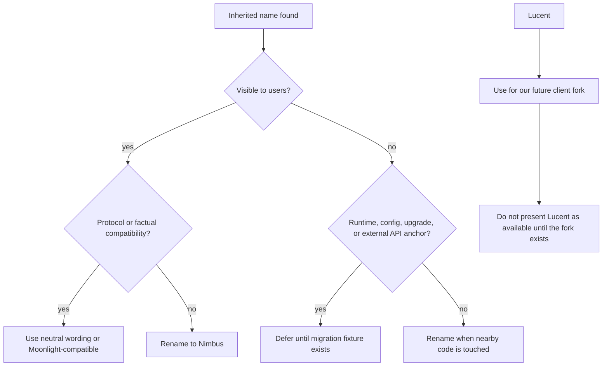

# Nimbus Naming Identity Audit

Snapshot date: 2026-05-21

This audit tracks inherited names from Vibepollo, Vibeshine, Apollo, Sunshine,
Moonlight, and Artemis. It separates visible Nimbus polish from compatibility
anchors that need a migration plan.

## Naming Policy



Guidance:

- `Nimbus` is the host product name.
- `Lucent` is reserved for the planned client project.
- Use `compatible client` in settings and support text when the exact client
  does not matter.
- Use `Moonlight-compatible client` where protocol compatibility or discoverable
  ecosystem wording matters.
- Use `Artemis` only for factual references, fixture evidence, or links to the
  current Artemis client.
- Do not rename runtime keys, service names, executable names, config filenames,
  upgrade codes, app ids, or protocol classes without a dedicated migration
  fixture.

## Current Scan Summary

Targeted scan commands:

```powershell
rg -n "Vibeshine|Vibepollo|Apollo|Sunshine|Moonlight|Artemis|Lucent" src_assets\common\assets\web
rg -n "Vibeshine|Vibepollo|Apollo|Sunshine|Moonlight|Artemis|Lucent" src tools packaging cmake scripts docs release_notes .github tests
rg -l "sunshine|Sunshine|Vibeshine|Vibepollo|Apollo|Moonlight|Artemis|Lucent" .
```

Repo-wide file-match counts on this snapshot:

| Term | Files |
| --- | ---: |
| `sunshine` | 181 |
| `Sunshine` | 150 |
| `Vibepollo` | 53 |
| `Moonlight` | 49 |
| `Apollo` | 37 |
| `Vibeshine` | 21 |
| `Artemis` | 9 |
| `Lucent` | 13 |

Top matched folders: `src` (82 files), `src_assets` (57), `packaging` (26),
`docs` (25), `cmake` (18), and `tests` (17).

High-signal findings:

| Area | Current stance | Notes |
| --- | --- | --- |
| English Web UI labels and descriptions | Rename or neutralize now | Current pass removed screenshot-level `Vibeshine` placeholders and most direct `Moonlight` instructions. |
| Web UI package manifest | Rename now | `src_assets/common/assets/web` now identifies as `nimbus-web` in package metadata and build output. |
| Non-English locale files | Defer as localization work | Many translations still say Vibepollo or Moonlight. Mechanical replacement would create bad translations. |
| `sunshine_name`, `vibeshine_file_state` config keys | Preserve | User-facing labels can say Nimbus, but changing keys affects config compatibility. |
| `sunshine_state.json`, `vibeshine_state.json`, `sunshine.log` defaults | Preserve for alpha | UI placeholders should not advertise inherited filenames, but runtime filename migration needs backup and upgrade tests. |
| `ApolloService` | Preserve for alpha | Visible service description is Nimbus Service; internal service name affects upgrade and uninstall behavior. |
| `SunshineVersion`, `sunshine_version.ts` | Defer | Internal comparator name, not visible UI. Rename later with tests. |
| `Moonlight-compatible clients` | Keep selectively | Accurate compatibility wording while Lucent does not exist. |
| `Artemis` in fixture notes | Keep | Factual test evidence from Shield TV pairing and stream smoke. |
| `Artemis` in client-link UI | Defer | It points to the current Artemis/Moonlight Android ecosystem. Replace with Lucent only when Lucent exists. |
| Historical release notes | Preserve | Upstream release-note files intentionally describe Vibepollo history. |
| Linux packaging ids and appstream | Defer | These are platform package identity surfaces and need their own Linux fixture. |

## Current Visible Cleanup

Completed in this pass:

- General settings host-name placeholder now says `Nimbus`.
- File settings placeholders now use neutral `Automatic` text instead of
  inherited filenames.
- The Web UI package manifest now uses `nimbus-web` so maintainer build output
  no longer prints `sunshine`.
- Lossless Scaling status and browse messages now say Nimbus.
- English locale copy now uses `compatible client` for certificate, private key,
  pairing, bitrate, input, and troubleshooting guidance.
- English video setting descriptions now say Nimbus instead of inherited
  Sunshine wording.
- The Web UI still says `Moonlight-compatible clients` in the product
  description because that is accurate for the first alpha.

## Deferred Migration Lanes

| Lane | Scope | Minimum validation |
| --- | --- | --- |
| Runtime config filenames | `sunshine_state.json`, `vibeshine_state.json`, `sunshine.log` | Backup, migration, rollback, upgrade from Apollo/Vibepollo, uninstall/reinstall. |
| Service identity | `ApolloService`, `sunshinesvc`, related scripts | Upgrade/uninstall fixture plus Windows service recovery tests. |
| Executable/helper names | `sunshine.exe`, `sunshine_display_helper.exe`, `sunshine_wgc_capture.exe` | Installer payload, service launch, crash/log collection, firewall, shortcuts. |
| Client identity | Artemis/Moonlight links and copy | Create Lucent fork or public repo first, then update links and client docs. |
| Translations | Non-English locale files | Human or reviewed machine translation pass; avoid blind replacement. |
| Linux platform identity | FQDN, desktop files, Flatpak/AppImage metadata | Linux package build and install smoke. |
