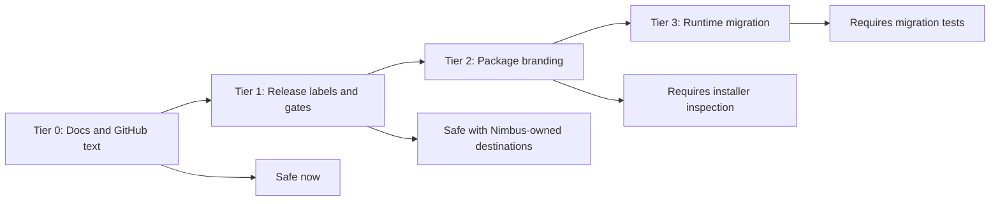
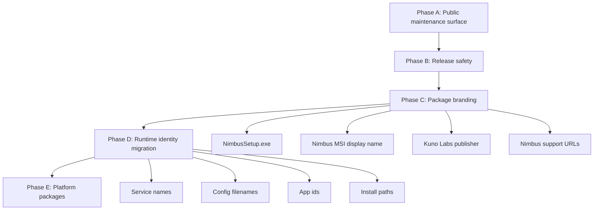
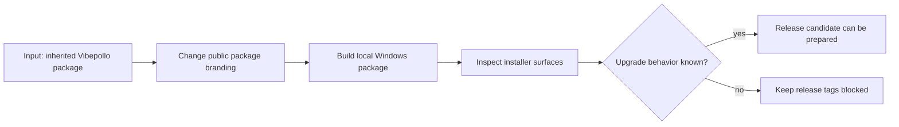

# Nimbus Packaging Identity Plan

Snapshot date: 2026-05-20

This plan separates public Nimbus branding from runtime identifiers that affect
installs, upgrades, shortcuts, services, config paths, and platform packages.
The fork inherited names from Vibepollo, Apollo, Sunshine, and Vibeshine. Some
of those names are user-facing strings. Others are compatibility anchors.

Do not rename every inherited identifier in one broad sweep. Each package or
runtime identity change should have a migration note, a rollback expectation,
and a validation path.

## Target Public Identity

| Surface | Nimbus target |
| --- | --- |
| Product name | Nimbus |
| Organization | Kuno Labs |
| Repository | `https://github.com/kunolabs/Nimbus` |
| Support URL | `https://github.com/kunolabs/Nimbus/issues` |
| Release tag pattern | `nimbus-v*` |
| Windows installer artifact | `NimbusSetup.exe` or `NimbusSetup-<version>.exe` |
| Package vendor | `Kuno Labs` |
| Client counterpart | Lucent |

## Risk Tiers

### Tier 0: Safe Public Surfaces

These can be updated early because they do not affect installed state:

- README, roadmap, support, security, governance, and contributing docs.
- Issue templates and GitHub metadata.
- Release notes and maintainer notes.
- Workflow comments and support text that do not change artifact routing.

Status: mostly complete for the initial public-maintenance pass.

### Tier 1: Release Automation Labels

These are low-risk but still affect public output:

- Release title and tag validation.
- Artifact glob names.
- Symbol repository defaults.
- Signing and WebRTC publish toggles.
- Issue-closing automation policy.

Status: hardened so Nimbus releases require `nimbus-v*` tags, symbol publishing
is disabled by default, SignPath submission is disabled, and WebRTC publication
requires an explicit confirmation string.

### Tier 2: Installer And Package Branding

These affect what users see during install, upgrade, and uninstall:

- `CPACK_PACKAGE_NAME`
- `CPACK_PACKAGE_VENDOR`
- `CPACK_PACKAGE_CONTACT`
- `CPACK_PACKAGE_HOMEPAGE_URL`
- Bootstrapper title, support links, and output names.
- Windows Start menu folder and shortcut names.
- Release artifact names.
- User-facing issue automation wording.

These should change in a dedicated packaging pass. The pass must verify whether
the resulting installer upgrades or coexists with Apollo, Vibepollo, and
Sunshine in the intended way.

### Tier 3: Runtime And Migration Identifiers

These are high-risk because they can affect installed services, config state,
platform app identity, and upgrade detection:

- `PROJECT_FQDN` and Linux app ids such as `dev.lizardbyte.app.Sunshine`.
- `WINDOWS_APP_USER_MODEL_ID`.
- Windows install directory, currently `Apollo`.
- WiX upgrade GUID and product-line seed.
- Windows service names, including `ApolloService` and `sunshinesvc`.
- Config and state filenames such as `sunshine.conf` and
  `sunshine_state.json`.
- Registry keys and Add/Remove Programs identifiers.
- Flatpak, desktop, metainfo, and system integration ids.

Do not change these until there is a tested migration plan.

## Current Inventory

| Area | Current inherited value | Recommendation |
| --- | --- | --- |
| CMake project | `project(Nimbus ...)` | Changed in Phase C. Verify generated artifacts. |
| Project homepage | `https://github.com/kunolabs/Nimbus` | Changed in Phase C. |
| Project FQDN | `dev.lizardbyte.app.Sunshine` | Defer until Linux desktop, Flatpak, and config migration are planned. |
| Windows app model id | `Nonary.Vibepollo` | Defer until shortcut/taskbar behavior is tested. |
| CPack package name | `Nimbus` | Changed in Phase C. Verify generated MSI and setup EXE names. |
| CPack vendor | `Kuno Labs` | Changed in Phase C. |
| CPack contact | `https://github.com/kunolabs/Nimbus/issues` | Changed in Phase C. |
| Windows install directory | `Apollo` | Defer or migrate with explicit install-path behavior. |
| WiX upgrade GUID | `{E3FA501A-85F8-4187-85A7-D6E6BDC7EDA1}` | Preserve unless we intentionally break upgrade lineage. |
| WiX product-line seed | `Vibepollo-<major>.<minor>` | Treat as high-risk. Change only with upgrade testing. |
| Bootstrapper namespace | `VibepolloInstaller` | Split cosmetic UI naming from installer detection logic. |
| Bootstrapper output | `NimbusSetup.exe` | Changed in Phase C. Validate with a local Windows package build. |
| Start menu folder | `Nimbus` | Changed in Phase C. Validate shortcut cleanup tests. |
| Service names | `ApolloService`, `SunshineService`, `VibeshineService`, `sunshinesvc` | Preserve detection and cleanup paths until migration logic is explicit. |
| Config/state files | `sunshine.conf`, `sunshine_state.json` | Preserve for first branded release unless migration is built and tested. |
| WebRTC release scripts | Nimbus wording and fallback repo | Publishing remains manual and confirmation-gated. |
| SignPath defaults | Nimbus project slug, no inherited org/policy fallback | Keep disabled until Nimbus signing exists. |

## First Nimbus Release Stance

The first Nimbus-branded release should choose one of two explicit positions:

1. **Compatibility-first release:** Package and docs say Nimbus, while release
   notes clearly state that some runtime ids, config files, and service names
   remain inherited for compatibility.
2. **Full identity release:** Package, service, app ids, and config paths move
   to Nimbus with migration logic, backups, and tested rollback behavior.

Recommendation: use the compatibility-first release first. It is the more
responsible path for existing Vibepollo and Apollo users because it avoids
breaking installed state before Nimbus has testers.

## Phased Work

### Phase A: Public Maintenance Surface

- Keep upstream attribution intact.
- Finish docs, support, security, governance, and issue templates.
- Explain Nimbus, Vibepollo, Apollo, and Sunshine lineage honestly.

Status: complete enough for public repo readiness.

### Phase B: Release Safety

- Require `nimbus-v*` tags for release automation.
- Disable or retarget signing, symbols, WebRTC publishing, and automatic issue
  closing.
- Make premature release tags fail before publishing inherited artifacts.

Status: complete enough for normal branch work. Do not tag a release yet.

### Phase C: Package Branding

- Change user-facing package metadata to Nimbus.
- Rename generated release artifacts to Nimbus.
- Update bootstrapper UI strings and support links.
- Keep service names, config paths, and upgrade GUIDs unchanged unless the test
  plan proves a migration is safe.
- Build on Windows and inspect the installer, generated filenames, Start menu
  entries, and uninstall entry.

Acceptance criteria:

- A local build produces a Nimbus-named installer.
- The installer does not publish or sign using upstream destinations.
- Upgrade behavior from an existing Vibepollo/Apollo install is recorded.
- Fresh install and uninstall behavior is recorded.
- Release notes disclose inherited runtime ids that remain in place.

### Phase D: Runtime Identity Migration

- Decide whether Nimbus needs new service names, config names, app ids, and
  install paths.
- Implement migration with backups, explicit logs, and rollback expectations.
- Test clean install, upgrade, downgrade, uninstall, reinstall, and parallel
  install scenarios where supported.

Acceptance criteria:

- Existing user config is preserved or intentionally migrated.
- Service replacement is deterministic.
- Users have clear manual recovery instructions.
- All platform package ids are documented.

### Phase E: Platform Packages

- Revisit Linux app id, desktop, metainfo, Flatpak, and package-manager naming.
- Revisit macOS bundle names if macOS packaging becomes active.
- Revisit symbol publishing and signing only after Nimbus-owned destinations
  exist.

## Open Decisions

- Should Nimbus keep compatibility with Vibepollo/Apollo upgrades by preserving
  the WiX upgrade GUID?
- Should Nimbus remain a direct replacement install, or support side-by-side
  installs with Apollo/Vibepollo?
- Should config filenames remain `sunshine.*` forever for compatibility, or move
  to `nimbus.*` after a migration window?
- Should the Windows service eventually become `NimbusService`, or remain
  inherited to reduce upgrade risk?
- Which hardware setup becomes the first release fixture for verification?

## Immediate Next Step

Do Phase C as a small, reviewable package-branding branch. Change package and
bootstrapper display names, keep runtime migration identifiers unchanged, build
locally, and document the actual installer behavior before creating any
`nimbus-v*` tag.
