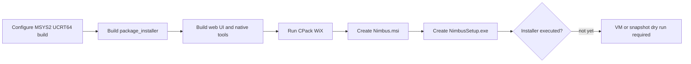

# Nimbus Release And Build Audit

Snapshot date: 2026-05-20

This audit captures the first maintainer pass after transferring Nimbus to the
`kunolabs` organization. It is intentionally conservative: the current goal is
to understand inherited automation before changing release behavior.

## Current Repository State

- Public repository: `https://github.com/kunolabs/Nimbus`
- Active branch: `master`
- Immediate upstream: `https://github.com/Nonary/Vibepollo`
- Reference upstreams:
  - `https://github.com/ClassicOldSong/Apollo`
  - `https://github.com/LizardByte/Sunshine`
- Local upstream remotes are fetch-only; push URLs are disabled for upstream
  remotes.
- Upstream branch heads were fetched with `--no-tags`.
- No upstream tags were imported locally during this pass.

## Workflow Inventory

| Workflow | Trigger | Risk | Notes |
| --- | --- | --- | --- |
| `.github/workflows/ci.yml` | push, pull request, manual | High | Builds Windows and can create GitHub releases from `nimbus-v*` tags. Release creation remains blocked on package-output validation. |
| `.github/workflows/ci-windows.yml` | reusable workflow | High | Builds Windows artifacts, downloads pinned WebRTC artifacts, optionally signs artifacts, and optionally publishes symbols. |
| `.github/workflows/webrtc-release.yml` | manual | High | Can publish pinned WebRTC release assets with `contents: write`. Publishing defaults to off and requires an explicit Nimbus confirmation string. |
| `.github/workflows/fixed-issue-follow-up.yml` | issue label, release published | Medium | Can comment when issues are labeled `fixed`; release-time closure is disabled during Nimbus bootstrap. |
| `.github/workflows/logs-needed-reminder.yml` | issue/comment events | Medium | Uses inherited Vibeshine/Sunshine log filename detection for compatibility. Instructions now use Nimbus wording. |
| `.github/workflows/logs-needed-closure.yml` | scheduled or issue state flow | Medium | Disabled during Nimbus bootstrap. Re-enable only after maintainer support policy is defined. |
| `.github/workflows/environment-specific-closure.yml` | issue label | Medium | Disabled during Nimbus bootstrap. Re-enable only after environment-specific closure policy is defined. |

## Release Automation Findings

The inherited release automation was not ready to use as-is for Nimbus releases.
A hardening pass has now been applied so accidental upstream-style releases are
less likely.

Original blockers:

- Release candidate detection accepted upstream-style tags like `1.15.4` and
  `v1.15.4`, not the approved Nimbus `nimbus-v*` tag protocol.
- Release notes are expected under `release_notes/<tag>.md`, with
  `release_notes/<version>.md` accepted as a fallback after removing the
  `nimbus-v` prefix.
- Product and artifact naming still uses `Vibepollo`.
- Symbol publishing defaulted to `Nonary/vibeshine_symbols`.
- SignPath defaults still use the upstream Vibepollo project slug and
  organization id.
- WebRTC artifacts point at `Nonary/vibeshine` in
  `third-party/webrtc-artifacts/windows-x64.json`.
- Release automation can close issues labeled `fixed`; this should not be
  enabled until Nimbus release notes and issue policy are ready.

Applied hardening:

- Release candidate detection now requires `nimbus-v*` tags.
- Release metadata now rejects non-Nimbus release tags.
- Symbol publishing is disabled by default from the main CI caller.
- Tag-triggered symbol publishing in the Windows reusable workflow is disabled;
  symbols require explicit `publish_symbols`.
- The default symbol repository is retargeted to `kunolabs/nimbus-symbols`, but
  publishing remains disabled until that repository and token policy exist.
- SignPath submission is disabled by passing no signing token to the Windows
  reusable workflow and blanking SignPath environment values.
- WebRTC publishing defaults to `false` and requires an explicit confirmation
  string.
- Main release creation no longer closes `fixed` issues directly.
- The separate fixed-issue release closer is disabled.
- Stale logs-needed closure and environment-specific closure jobs are disabled
  until Nimbus has a public support policy.

Remaining release blocker: the current release-prep commit now builds
Nimbus-named Windows artifacts locally, but a release tag is still blocked until
installer execution is tested in a VM or snapshot fixture and release notes are
prepared.

Decision: CI is safer for normal branch work and manual investigation, but do
not intentionally create a Nimbus release tag until package install, upgrade,
and uninstall behavior is recorded.

## Build And Packaging Findings

The source now has Nimbus package branding but still has inherited runtime
identity:

- `CMakeLists.txt` declares `project(Nimbus ...)`.
- `PROJECT_FQDN` is still `dev.lizardbyte.app.Sunshine`.
- `WINDOWS_APP_USER_MODEL_ID` is still `Nonary.Vibepollo`.
- CPack package name is now `Nimbus`.
- Fresh Windows installs default to `Nimbus`.
- Windows WiX product family is seeded with `Vibepollo`.
- Bootstrapper text, support links, and output names now use Nimbus.
- Several installer paths intentionally detect or migrate Apollo and Sunshine.

Runtime identifiers should not be renamed in one broad sweep. Upgrade codes,
service names, config paths, and app ids can affect upgrades and coexistence
with Apollo/Vibepollo/Sunshine.

## Local Windows Package Validation

Validation date: 2026-05-20

Validated commit: `82fa5cdd`

Scope: full local Windows package build for the Phase C Nimbus packaging slice.
This validates generated package artifacts, not installer execution on a target
machine.



Tooling used:

```bash
MSYS2 UCRT64
cmake 4.3.2
ninja 1.13.2
g++ 16.1.0
WiX Toolset v3.14.1 portable binaries
Git for Windows via -DGIT_EXECUTABLE=C:/Progra~1/Git/cmd/git.exe
```

Build configuration:

```bash
cmake -B build/nimbus-package-validation -G Ninja -S . \
  -DCMAKE_BUILD_TYPE=Release \
  -DBUILD_DOCS=OFF \
  -DBUILD_TESTS=OFF \
  -DSUNSHINE_ENABLE_WEBRTC=OFF \
  -DGIT_EXECUTABLE=C:/Progra~1/Git/cmd/git.exe

WIX=K:/CODEX/game-dev/game-streaming/Nimbus/build/nimbus-package-validation/tools/wix314 \
  ninja -C build/nimbus-package-validation package_installer
```

Result:

| Check | Result | Notes |
| --- | --- | --- |
| Git submodules | Pass | Initialized recursively before the package build. |
| CMake configure | Pass | WebRTC disabled for this validation pass. |
| Native build | Pass | Non-fatal unused-code warnings remain in `src/webrtc_stream.cpp`. |
| Web UI build | Pass | Vite reported large vendor chunk warnings only. |
| CPack WiX MSI | Pass | WiX ICE validation required normal Windows Installer service access. |
| Bootstrapper | Pass | Final version text resolved to `0.0.0.30 (82fa5cdd)`. |
| Signing | Skipped | `SIGNPATH_API_TOKEN` was unset; output is unsigned. |
| Authenticode | Expected | `NimbusSetup.exe` reports `NotSigned`. |

Artifacts:

| Artifact | Size | SHA256 |
| --- | ---: | --- |
| `build/nimbus-package-validation/cpack_artifacts/NimbusSetup.exe` | 25,866,752 | `F0C161A08BD9696E500EC694B0723CB769A5E5A0C8E3B031B5838DBCAE4E3338` |
| `build/nimbus-package-validation/cpack_artifacts/Nimbus.msi` | 25,602,498 | `525AAB47E3539CE29521AC67592996BFA1535E8AE91405442C1A82EAC403FDF1` |

Caveats:

- These are local validation artifacts, not public release candidates.
- The installer was not executed on the host machine.
- Fresh install, upgrade from Apollo/Vibepollo, uninstall, and reinstall
  behavior are not yet recorded.
- The package version remains `0.0.0.30` because Nimbus has no `nimbus-v*` tag
  yet.
- Signing and symbol publishing remain disabled until Nimbus-owned destinations
  and secrets exist.

## Local Windows Package Revalidation

Validation date: 2026-05-21

Validated commits: `ce9ec7aa`, `fe7b7422`, `f14d443b`

Scope: revalidate the Nimbus release-safety, visible web branding, visible
Windows branding, and CMake web packaging fixes after VM fixture feedback.

Result:

| Check | Result | Notes |
| --- | --- | --- |
| Web UI production build | Pass | `npm run build` passes after restoring dependencies. Vite still reports inherited large vendor chunk warnings. |
| English locale JSON parse | Pass | `en.json`, `en_GB.json`, and repaired `en_US.json` parse successfully. |
| Native Windows host build | Pass | `cmake --build build/nimbus-package-validation --target sunshine --config Release -j 6` passes when `C:\msys64\ucrt64\bin` is on `PATH`. |
| Bootstrapper C# compile | Pass | `build_bootstrapper.ps1 -UninstallOnly` compiles the shared installer source. |
| CMake package web step | Pass | Windows CMake now prefers `C:/Program Files/nodejs/npm.cmd` and uses a build-local npm cache. |
| CPack WiX MSI | Blocked | Current host does not expose WiX v3 `candle.exe` / `light.exe`, so `package_installer` stops at CPack WiX. |

Useful command shape:

```powershell
$env:PATH = 'C:\msys64\ucrt64\bin;' + $env:PATH
cmake -S . -B build\nimbus-package-validation -UNPM
cmake --build build\nimbus-package-validation --target package_installer --config Release -j 6
```

Historical package blocker:

```text
Could not find the WiX candle executable.
```

This blocker was resolved by making WiX Toolset v3.14.1 portable binaries
discoverable through `WIX`. The old `82fa5cdd` artifacts above are historical
validation evidence only; do not promote them as the current release candidate.

## Local UI And Status Revalidation

Validation date: 2026-05-21

Validated commits: `2ab4bf99`, `5bdc0784`, `3d8197ae`, `79de18b6`

Scope: revalidate the additional Nimbus visible web copy sweep, first app-shell
identity token pass, Windows status/log message rebrand, and static
onboarding/header branding pass.

Result:

| Check | Result | Notes |
| --- | --- | --- |
| Web UI production build | Pass | `npm run build` passes. Vite still reports inherited large vendor chunk warnings. |
| Targeted visible-name scan | Pass | Targeted Vue shell, app-edit, troubleshooting, Playnite, and English locale surfaces no longer contain `Vibepollo`. |
| Static onboarding scan | Pass | `welcome.html`, `login.html`, and `template_header.html` no longer reference the Apollo logo, `sunshine.ico`, or the `apollo` default first username. |
| English locale JSON parse | Pass | `en.json`, `en_GB.json`, and `en_US.json` parse successfully after the broader Nimbus copy sweep. |
| Native Windows host build | Pass | `cmake --build build\nimbus-package-validation --target sunshine --config Release -j 6` passes when `C:\msys64\ucrt64\bin` is on `PATH`. |
| Figma UI kit automation | Blocked | Existing Figma Starter-plan MCP call limit still blocks automated UI kit population. `docs/ui-identity-plan.md` remains the implementation source of truth. |

Current visual-design state:

- The Vue app shell and login/logout surfaces no longer depend on the inherited
  Apollo logo image.
- Legacy first-run and login HTML use the Nimbus mark and `nimbus` as the
  default first username.
- Tailwind semantic tokens now use the Nimbus blue, Lucent mint, neutral host
  console, amber, green, and red token direction from `docs/ui-identity-plan.md`.
- RTSS and Windows troubleshooting status text now uses Nimbus wording for
  user-visible guidance.
- Tray menu text, launcher export headers, default discovery fallback, service
  display text, and in-app client-control help links now use Nimbus-owned
  wording and docs.
- The uninstaller quick-tip panel now uses uninstall-specific copy instead of
  reusing install/upgrade guidance.

## Current Full Package Revalidation

Validation date: 2026-05-21

Validated source commit: `4f3411b2`

Scope: rebuild the full Windows package after the visible Nimbus web shell,
static onboarding, Windows status copy, remaining visible host-branding cleanup,
uninstaller quick-tip copy, manual update-check feedback, English session
tooltip polish, release-note, and release-safety passes. This validates
generated package artifacts, not installer execution on a target machine.

Command shape:

```powershell
$env:PATH = 'C:\msys64\ucrt64\bin;' + $env:PATH
$env:WIX = 'K:\CODEX\game-dev\game-streaming\Nimbus\build\nimbus-package-validation\tools\wix314'
cmake --build build\nimbus-package-validation --target package_installer --config Release -j 6
```

Result:

| Check | Result | Notes |
| --- | --- | --- |
| Web UI production build | Pass | Vite still reports inherited large vendor chunk warnings only. |
| CPack WiX MSI | Pass | Initial sandbox run reached WiX but failed ICE validation because Windows Installer service access was unavailable; rerunning outside the sandbox with the same `WIX` path passed. |
| Bootstrapper | Pass | Final file metadata resolves to `Nimbus Installer`, `0.0.0.44`, `4f3411b2`, `Kuno Labs`. |
| Signing | Skipped | `SIGNPATH_API_TOKEN` was unset; output is unsigned. |
| Installer execution | Partial | Manual VM smoke observed Nimbus default install path, visible Nimbus wording, service running with Nimbus description, Web UI launch path, manual update-check feedback, Artemis-on-Shield pairing, Artemis streaming/disconnect, and no Defender warning. Uninstall/reinstall and upgrade behavior still need fixture records. |

Follow-up on 2026-05-27: the bootstrapper gained a Nimbus-line
upgrade-preservation guard for user-owned config, cover, credential, log,
session, and script files. Compile-only validation passed for both
`-UninstallOnly` and MSI-embedded setup builds, but VM upgrade execution is
still required before release claims.

Artifacts:

| Artifact | Size | SHA256 |
| --- | ---: | --- |
| `build/nimbus-package-validation/cpack_artifacts/NimbusSetup.exe` | 25,871,872 | `EEAD1749BA88032AFD09E7FBB1917B50DDA88F425059CEEDC18775ADE3028328` |
| `build/nimbus-package-validation/cpack_artifacts/Nimbus.msi` | 25,606,727 | `6E739CE9F56B11A0FD5B824E460AB389A0C61216FEE2CCE8DAA30E1E27F48D4E` |

Current caveat: these artifacts are newer and better branded than the earlier
`82fa5cdd` validation artifacts, but they are still local validation artifacts
until the remaining VM uninstall, reinstall, and upgrade evidence is recorded.

## Required Secrets Before Release CI

| Secret | Purpose | Current Risk |
| --- | --- | --- |
| `SIGNPATH_API_TOKEN` | Submit/sign Windows artifacts | SignPath has no inherited upstream org/policy fallback now, but CI still disables signing until Nimbus-owned settings exist. |
| `SYMBOL_TOKEN` | Publish private symbols release | Retargeted to `kunolabs/nimbus-symbols`, but still disabled until a Nimbus symbol repo and policy exist. |
| `GITHUB_TOKEN` | Release creation and issue automation | Built-in token is fine, but workflows need Nimbus tag and wording changes first. |

## Recommended Next Actions

1. Finish the Windows VM fixture: uninstaller quick-tip retest, uninstall,
   reinstall, compatible-client pairing, short stream smoke, and upgrade checks
   where practical.
2. Prepare the first alpha release notes for `nimbus-v0.1.0-alpha.1`.
3. Review issue automation policy before enabling automatic issue closures.
4. Create a Nimbus symbol publishing plan before enabling `publish_symbols`.
5. Use `docs/upstream-issue-radar.md` to select the first credibility fixes.

## Current Verdict

Nimbus is ready for documentation, issue triage work, and first-alpha release
planning. The current Windows package build now completes locally, but Nimbus is
not yet ready for public release-tag publication because installer execution and
upgrade behavior still need fixture validation.
