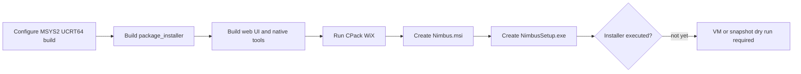

# Nimbus Release And Build Audit

Snapshot date: 2026-05-20

This audit captures the first maintainer pass after transferring Nimbus to the
`kunolabs` organization. It is intentionally conservative: the current goal is
to understand inherited automation before changing release behavior.

## Current Repository State

- Public repository: `https://github.com/kunolabs/Nimbus`
- Active branch: `master`
- Immediate upstream: `https://github.com/Nonary/Vibepollo`
- Reference upstreams:
  - `https://github.com/ClassicOldSong/Apollo`
  - `https://github.com/LizardByte/Sunshine`
- Local upstream remotes are fetch-only; push URLs are disabled for upstream
  remotes.
- Upstream branch heads were fetched with `--no-tags`.
- No upstream tags were imported locally during this pass.

## Workflow Inventory

| Workflow | Trigger | Risk | Notes |
| --- | --- | --- | --- |
| `.github/workflows/ci.yml` | push, pull request, manual | High | Builds Windows and can create GitHub releases from `nimbus-v*` tags. Release creation remains blocked on package-output validation. |
| `.github/workflows/ci-windows.yml` | reusable workflow | High | Builds Windows artifacts, downloads pinned WebRTC artifacts, optionally signs artifacts, and optionally publishes symbols. |
| `.github/workflows/webrtc-release.yml` | manual | High | Can publish pinned WebRTC release assets with `contents: write`. Publishing defaults to off and requires an explicit Nimbus confirmation string. |
| `.github/workflows/fixed-issue-follow-up.yml` | issue label, release published | Medium | Comments on and closes issues labeled `fixed`. Useful later, but should be reworded and checked before relying on it publicly. |
| `.github/workflows/logs-needed-reminder.yml` | issue/comment events | Medium | Uses inherited Vibeshine/Sunshine log filename detection for compatibility. Instructions now use Nimbus wording. |
| `.github/workflows/logs-needed-closure.yml` | scheduled or issue state flow | Medium | Can close issues for missing logs. Needs maintainer policy review before use. |
| `.github/workflows/environment-specific-closure.yml` | issue label | Medium | Closes issues as not planned when labeled `environment-specific`. Wording now says Nimbus. |

## Release Automation Findings

The inherited release automation was not ready to use as-is for Nimbus releases.
A hardening pass has now been applied so accidental upstream-style releases are
less likely.

Original blockers:

- Release candidate detection accepted upstream-style tags like `1.15.4` and
  `v1.15.4`, not the approved Nimbus `nimbus-v*` tag protocol.
- Release notes are expected under `release_notes/<tag>.md`, with
  `release_notes/<version>.md` accepted as a fallback after removing the
  `nimbus-v` prefix.
- Product and artifact naming still uses `Vibepollo`.
- Symbol publishing defaulted to `Nonary/vibeshine_symbols`.
- SignPath defaults still use the upstream Vibepollo project slug and
  organization id.
- WebRTC artifacts point at `Nonary/vibeshine` in
  `third-party/webrtc-artifacts/windows-x64.json`.
- Release automation can close issues labeled `fixed`; this should not be
  enabled until Nimbus release notes and issue policy are ready.

Applied hardening:

- Release candidate detection now requires `nimbus-v*` tags.
- Release metadata now rejects non-Nimbus release tags.
- Symbol publishing is disabled by default from the main CI caller.
- Tag-triggered symbol publishing in the Windows reusable workflow is disabled;
  symbols require explicit `publish_symbols`.
- The default symbol repository is retargeted to `kunolabs/nimbus-symbols`, but
  publishing remains disabled until that repository and token policy exist.
- SignPath submission is disabled by passing no signing token to the Windows
  reusable workflow and blanking SignPath environment values.
- WebRTC publishing defaults to `false` and requires an explicit confirmation
  string.
- Main release creation no longer closes `fixed` issues directly.
- The separate fixed-issue release closer is disabled.

Remaining release blocker: package branding now emits Nimbus-named artifacts and
the local Windows package build has verified the final installer output. A
release tag is still blocked until installer execution is tested in a VM or
snapshot fixture and release notes are prepared.

Decision: CI is safer for normal branch work and manual investigation, but do
not intentionally create a Nimbus release tag until package install, upgrade,
and uninstall behavior is recorded.

## Build And Packaging Findings

The source now has Nimbus package branding but still has inherited runtime
identity:

- `CMakeLists.txt` declares `project(Nimbus ...)`.
- `PROJECT_FQDN` is still `dev.lizardbyte.app.Sunshine`.
- `WINDOWS_APP_USER_MODEL_ID` is still `Nonary.Vibepollo`.
- CPack package name is now `Nimbus`.
- Windows install directory is still `Apollo`.
- Windows WiX product family is seeded with `Vibepollo`.
- Bootstrapper text, support links, and output names now use Nimbus.
- Several installer paths intentionally detect or migrate Apollo and Sunshine.

Runtime identifiers should not be renamed in one broad sweep. Upgrade codes,
service names, config paths, and app ids can affect upgrades and coexistence
with Apollo/Vibepollo/Sunshine.

## Local Windows Package Validation

Validation date: 2026-05-20

Validated commit: `82fa5cdd`

Scope: full local Windows package build for the Phase C Nimbus packaging slice.
This validates generated package artifacts, not installer execution on a target
machine.



Tooling used:

```bash
MSYS2 UCRT64
cmake 4.3.2
ninja 1.13.2
g++ 16.1.0
WiX Toolset v3.14.1 portable binaries
Git for Windows via -DGIT_EXECUTABLE=C:/Progra~1/Git/cmd/git.exe
```

Build configuration:

```bash
cmake -B build/nimbus-package-validation -G Ninja -S . \
  -DCMAKE_BUILD_TYPE=Release \
  -DBUILD_DOCS=OFF \
  -DBUILD_TESTS=OFF \
  -DSUNSHINE_ENABLE_WEBRTC=OFF \
  -DGIT_EXECUTABLE=C:/Progra~1/Git/cmd/git.exe

WIX=K:/CODEX/game-dev/game-streaming/Nimbus/build/nimbus-package-validation/tools/wix314 \
  ninja -C build/nimbus-package-validation package_installer
```

Result:

| Check | Result | Notes |
| --- | --- | --- |
| Git submodules | Pass | Initialized recursively before the package build. |
| CMake configure | Pass | WebRTC disabled for this validation pass. |
| Native build | Pass | Non-fatal unused-code warnings remain in `src/webrtc_stream.cpp`. |
| Web UI build | Pass | Vite reported large vendor chunk warnings only. |
| CPack WiX MSI | Pass | WiX ICE validation required normal Windows Installer service access. |
| Bootstrapper | Pass | Final version text resolved to `0.0.0.30 (82fa5cdd)`. |
| Signing | Skipped | `SIGNPATH_API_TOKEN` was unset; output is unsigned. |
| Authenticode | Expected | `NimbusSetup.exe` reports `NotSigned`. |

Artifacts:

| Artifact | Size | SHA256 |
| --- | ---: | --- |
| `build/nimbus-package-validation/cpack_artifacts/NimbusSetup.exe` | 25,866,752 | `F0C161A08BD9696E500EC694B0723CB769A5E5A0C8E3B031B5838DBCAE4E3338` |
| `build/nimbus-package-validation/cpack_artifacts/Nimbus.msi` | 25,602,498 | `525AAB47E3539CE29521AC67592996BFA1535E8AE91405442C1A82EAC403FDF1` |

Caveats:

- These are local validation artifacts, not public release candidates.
- The installer was not executed on the host machine.
- Fresh install, upgrade from Apollo/Vibepollo, uninstall, and reinstall
  behavior are not yet recorded.
- The package version remains `0.0.0.30` because Nimbus has no `nimbus-v*` tag
  yet.
- Signing and symbol publishing remain disabled until Nimbus-owned destinations
  and secrets exist.

## Required Secrets Before Release CI

| Secret | Purpose | Current Risk |
| --- | --- | --- |
| `SIGNPATH_API_TOKEN` | Submit/sign Windows artifacts | SignPath has no inherited upstream org/policy fallback now, but CI still disables signing until Nimbus-owned settings exist. |
| `SYMBOL_TOKEN` | Publish private symbols release | Retargeted to `kunolabs/nimbus-symbols`, but still disabled until a Nimbus symbol repo and policy exist. |
| `GITHUB_TOKEN` | Release creation and issue automation | Built-in token is fine, but workflows need Nimbus tag and wording changes first. |

## Recommended Next Actions

1. Run installer dry-runs in a Windows VM or snapshot fixture.
2. Prepare the first alpha release notes for `nimbus-v0.1.0-alpha.1`.
3. Review issue automation policy before enabling automatic issue closures.
4. Create a Nimbus symbol publishing plan before enabling `publish_symbols`.
5. Use `docs/upstream-issue-radar.md` to select the first credibility fixes.

## Current Verdict

Nimbus is ready for documentation, issue triage work, and first-alpha release
planning. It is not yet ready for public release-tag publication because
installer execution and upgrade behavior still need fixture validation.
