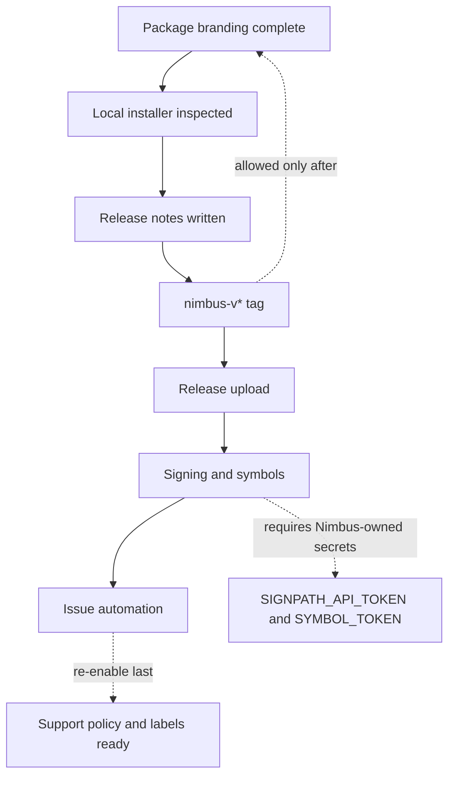

# Nimbus Release Process

Nimbus follows a lean downstream-maintainer release process. The public Nimbus
namespace should contain only branches and tags that Nimbus intends to maintain.
Upstream refs remain available through remotes for audit and comparison.

## Remotes

Use these remote names:

| Remote | URL | Purpose |
| --- | --- | --- |
| `origin` | `https://github.com/kunolabs/Nimbus.git` | Nimbus public repository |
| `upstream-vibepollo` | `https://github.com/Nonary/Vibepollo.git` | Immediate upstream base |
| `upstream-apollo` | `https://github.com/ClassicOldSong/Apollo.git` | Apollo lineage reference |
| `upstream-sunshine` | `https://github.com/LizardByte/Sunshine.git` | Sunshine lineage reference |

Do not push upstream branches or tags into `origin` unless a maintainer has
explicitly promoted that ref as a Nimbus-maintained branch or release.

Recommended local safety setup:

```bash
git remote set-url --push upstream-vibepollo DISABLED
git remote set-url --push upstream-apollo DISABLED
git remote set-url --push upstream-sunshine DISABLED
```

## Branches

| Pattern | Purpose |
| --- | --- |
| `master` or `main` | Active integration branch |
| `stable/<major>.<minor>` | Maintained stable line |
| `release/<major>.<minor>.<patch>` | Temporary release prep branch |
| `feature/<topic>` | Feature work |
| `fix/<topic>` | Bug fixes |
| `docs/<topic>` | Documentation-only work |

Stable branches should be boring. Only merge fixes that are intended for users on
that line, and keep release notes clear about what changed.

## Tags

Nimbus tags use a `nimbus-` prefix:

```text
nimbus-v0.1.0-alpha.1
nimbus-v0.1.0-beta.1
nimbus-v0.1.0
nimbus-v0.1.1
```

Do not use plain upstream-style tags such as `1.15.5` for Nimbus releases. Those
names are reserved for upstream history and would confuse users.

Never run:

```bash
git push --tags
```

Use an explicit tag push:

```bash
git push origin nimbus-v0.1.0
```

Release automation rejects upstream-style tags such as `1.15.5` and `v1.15.5`.
Until the package-branding slice in `docs/packaging-identity-plan.md` is
validated with a local Windows package build, a `nimbus-v*` tag should still be
treated as unsafe for publication. The expected release artifact is
`NimbusSetup*.exe`.

## Release Notes

Every Nimbus release note should separate:

- Nimbus-specific changes.
- Inherited upstream changes.
- Known issues.
- Upgrade or migration notes.
- Verification performed.

Do not claim broad performance wins from one machine. Label results as fixture
benchmarks, local smoke tests, or field notes.

## Upstream Syncs

Syncs from Vibepollo should be their own branch or pull request whenever
possible.

Before syncing:

- Record the upstream branch or tag.
- Record the upstream commit.
- Record the current Nimbus base commit.
- Decide whether this is an integration sync, stable backport, or cherry-pick.

After syncing:

- Run the relevant build or validation path.
- Update release notes or maintainer notes.
- Identify user-facing behavior changes.

## First Nimbus Release Checklist



- Review `docs/release-build-audit.md`.
- Review `docs/packaging-identity-plan.md`.
- Confirm repository links point at `kunolabs/Nimbus`.
- Confirm license and upstream attribution are intact.
- Confirm issue templates are Nimbus-branded.
- Confirm CI workflows are safe for the org repository.
- Confirm the Windows installer artifact is Nimbus-branded.
- Confirm inherited runtime ids that remain in place are listed in release
  notes.
- Confirm signing and symbol publishing have Nimbus-owned destinations.
- Confirm artifacts do not pretend to be upstream releases.
- Confirm tag name uses the `nimbus-` prefix.
