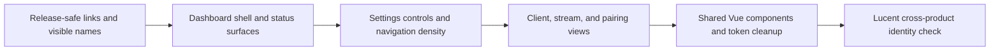

# Nimbus UI Identity Plan

Nimbus should feel like a calm host console for game streaming: operational,
local-first, and trustworthy under maintenance pressure. This document records
the first visual direction before a full Web UI overhaul.

## Goals

- Make Nimbus visibly distinct from Apollo, Vibepollo, Sunshine, and Vibeshine
  without breaking inherited compatibility.
- Keep the first screen useful: host status, release safety, driver readiness,
  clients, and common actions.
- Prefer compact, repeatable controls over marketing-style layout.
- Keep design work progressive so each PR is reviewable and reversible.

## Identity Principles

| Principle | UI Consequence |
| --- | --- |
| Local-first trust | Show service, ports, drivers, release state, and fixture state plainly. |
| Host-console calm | Use restrained surfaces, crisp borders, small radii, and dense scan paths. |
| Streaming confidence | Surface stream health, display state, pairing, and recovery actions early. |
| Compatibility honesty | Label inherited runtime names as compatibility choices until migration exists. |
| Contributor clarity | Keep release gates, issue links, and support routes visibly Nimbus-owned. |

## Draft Token Direction

Nimbus should avoid becoming a single-hue blue or purple UI. The initial palette
balances a neutral operational base with distinct signal colors.

| Token | Hex | Use |
| --- | --- | --- |
| Cloud Ink | `#0D1117` | Sidebar, top-level contrast, brand anchor |
| Nimbus Blue | `#2563EB` | Primary actions, active navigation, links |
| Lucent Mint | `#2DD4BF` | Healthy streaming, client/pairing accent |
| Signal Amber | `#F59E0B` | Unsigned builds, driver warnings, pending gates |
| Health Green | `#22C55E` | Passing fixture, running services |
| Fault Red | `#F43F5E` | Crash, blocked release, destructive actions |
| Mist Surface | `#F6F8FB` | App background |
| Line Frost | `#D8E3F2` | Borders and dividers |

## Component Priorities

| Priority | Component | Reason |
| --- | --- | --- |
| 1 | App shell and navigation | Replaces the strongest inherited identity signals. |
| 1 | Release/status alert | Prevents unsafe upstream update or downgrade prompts. |
| 1 | Host status cards | Makes install, service, port, and driver state inspectable. |
| 2 | Buttons and icon buttons | Establishes action hierarchy across settings and dashboard. |
| 2 | Form controls | Settings pages need dense, predictable editing surfaces. |
| 2 | Changelog/release notes panel | Keeps alpha caveats and release provenance readable. |
| 3 | Client/session views | Connects Nimbus host identity with Lucent client direction. |

## Progressive Overhaul

## First PR Slices

| Slice | Scope | Validation |
| --- | --- | --- |
| UI-1 | Browser title, login shell, dashboard greeting, resource links, app-shell token pass | Vite build and VM screenshot |
| UI-2 | Dashboard status cards and update/release alert layout | Vite build and responsive screenshots |
| UI-3 | Settings navigation and form density pass | Vite build, keyboard navigation, mobile width check |
| UI-4 | Changelog and support surfaces | Vite build, no upstream release links |

## Implementation Notes

- The first implementation slice should replace inherited Apollo/Sunshine visual
  anchors before larger layout work: shell navigation, login/logout brand mark,
  and semantic Tailwind/Naive UI color tokens.
- Keep source compatibility names separate from visible product identity. If a
  backend feature still uses an inherited folder, profile, or executable name,
  prefer neutral wording such as "managed profile" until that runtime migration
  is complete.

## Figma Status

A private `Nimbus UI Kit v0.1` Figma file exists for maintainer exploration.
The current Starter-plan MCP call limit blocked automated canvas population, so
the repo keeps this document as the source of truth until the Figma board can be
filled from the same component and token plan.

Do not treat the Figma board as implementation authority until it has been
reviewed against actual Web UI screenshots and accepted as the current design
contract.
