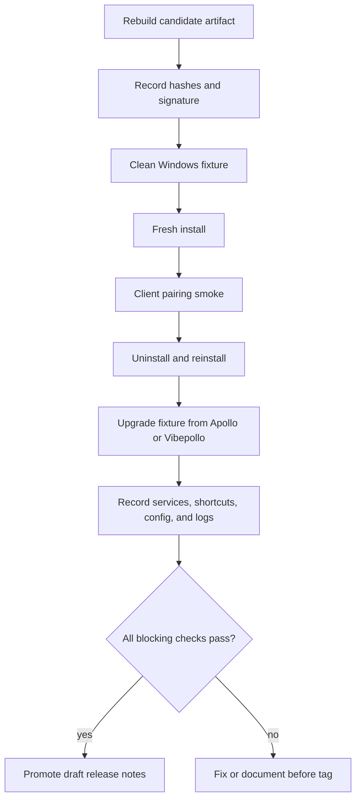

# Nimbus Windows Installer Fixture

Snapshot date: 2026-05-21

This fixture is the release gate for the first Nimbus alpha. It is intentionally
separate from the local package build audit: the package build proves that
artifacts can be generated, while this fixture proves that the generated
installer behaves responsibly on a Windows machine.

Do not run this fixture on a daily-use host first. Use a Windows VM, a snapshot,
or another machine that can be rolled back.

## Fixture Flow



## Candidate Artifact

The current local package validation produced these artifacts from source commit
`0af1f3b8`. The documentation commit that records these hashes may be newer than
the validated source commit.

| Artifact | Size | SHA256 |
| --- | ---: | --- |
| `build/nimbus-package-validation/cpack_artifacts/NimbusSetup.exe` | 25,871,872 | `4091BACCA4CF23356C583956606D18451D3516ABDA8D35438996A9693BE66F20` |
| `build/nimbus-package-validation/cpack_artifacts/Nimbus.msi` | 25,606,719 | `6B348D3516352DE46690940A0241B9DB38B1FA4F56ECF856A4BE7E52BE7A63EC` |

Before tagging `nimbus-v0.1.0-alpha.1`, either use these artifacts for fixture
testing or rebuild the package from the final release-prep commit and replace
the hashes here. These are still local validation artifacts until the fixture
matrix below is recorded.

Current artifact metadata:

| Field | Value |
| --- | --- |
| Bootstrapper product | `Nimbus Installer` |
| File version | `0.0.0.41` |
| Product version | `0af1f3b8` |
| Company | `Kuno Labs` |
| Signing | Unsigned; SignPath skipped because `SIGNPATH_API_TOKEN` is unset |

## Fixture Matrix

| Scenario | Required before alpha? | Status | Evidence |
| --- | --- | --- | --- |
| Fresh install on clean Windows 11 x64 | Yes | Pending | Installer log, screenshots, service state |
| Launch Web UI after install | Yes | Pending | Local URL opens and login/setup path is reachable |
| Pair with a compatible client | Yes | Pending | Artemis, Moonlight, or current compatible client can see the host |
| Start a short stream session | Yes | Pending | One local-network stream smoke, with hardware encoder noted |
| Uninstall | Yes | Pending | Add/Remove Programs entry removed and service stopped |
| Reinstall after uninstall | Yes | Pending | Reinstall completes without manual cleanup |
| Upgrade from Vibepollo | Strongly recommended | Pending | Config, credentials, and paired-client state checked |
| Upgrade from Apollo | Strongly recommended | Pending | Config, credentials, and paired-client state checked |
| Coexistence with Sunshine | Optional for alpha | Pending | Record whether install replaces or coexists |
| Windows SmartScreen/AV behavior | Yes | Pending | Unsigned prompt or false-positive notes recorded |

## Partial Manual Fixture Notes

Date: 2026-05-21

Candidate artifact: `NimbusSetup.exe` from source commit `0af1f3b8`
(`0.0.0.41`). These notes summarize the maintainer VM smoke loop. Screenshots
and fixture handoff folders are local validation evidence and are not committed
to the public repository.

Observed so far:

| Check | Status | Notes |
| --- | --- | --- |
| Default install path | Observed pass | Fresh install defaults to `C:\Program Files\Nimbus`. |
| Visible installer and app branding | Observed pass | Maintainer-confirmed visible checks use Nimbus wording, including installer surfaces and Web UI/dashboard copy. |
| Windows service after install | Observed compatibility pass | Service is running. Internal service name remains `ApolloService`; visible service description is `Nimbus Service`. |
| Web UI launch path | Observed pass | Tray context menu can open the local Web UI. Browser certificate warning is expected for the inherited local HTTPS flow. |
| Uninstall confirmation modal | Observed pass | Modal copy correctly describes uninstall options and factory-reset behavior. |
| Uninstaller quick tips | Fixed, retest pending | An older candidate reused install/upgrade tips in uninstall mode. Fixed in `0af1f3b8`; retest with `0.0.0.41`. |
| Windows Defender prompt | Observed pass | Maintainer reported no Defender warning during the install smoke. |

Still blocking the alpha gate:

- Confirm the `0.0.0.41` uninstaller quick tips show uninstall-specific copy.
- Confirm uninstall removes or stops the service and removes the Add/Remove
  Programs entry.
- Confirm reinstall after uninstall completes without manual cleanup.
- Run at least one compatible-client pairing and short stream smoke.
- Record upgrade behavior from Apollo and/or Vibepollo where practical.

## Evidence Commands

The recommended path is to run the evidence collector before install, after
install, and after uninstall from inside the fixture VM. The script does not
install or uninstall Nimbus; it only records evidence.

Copy `NimbusSetup.exe` and the repository `scripts/` directory into the same
fixture working folder before running these commands.

```powershell
powershell -ExecutionPolicy Bypass -File .\scripts\collect_windows_installer_fixture.ps1 `
  -Stage preinstall `
  -InstallerPath .\NimbusSetup.exe `
  -SkipWebUiProbe

powershell -ExecutionPolicy Bypass -File .\scripts\collect_windows_installer_fixture.ps1 `
  -Stage postinstall `
  -InstallerPath .\NimbusSetup.exe

powershell -ExecutionPolicy Bypass -File .\scripts\collect_windows_installer_fixture.ps1 `
  -Stage postuninstall `
  -InstallerPath .\NimbusSetup.exe `
  -SkipWebUiProbe
```

Each run writes `fixture-summary.md` and `fixture-evidence.json` under a local
`nimbus-fixture-evidence/` folder. Attach or summarize those outputs in the PR,
but remove secrets, pairing PINs, user credentials, private hostnames, and
private network details first.

If you need to capture evidence manually, run these from the directory
containing the candidate installer:

```powershell
Get-FileHash .\NimbusSetup.exe -Algorithm SHA256
Get-AuthenticodeSignature .\NimbusSetup.exe
```

After install, capture service and uninstall-entry state:

```powershell
Get-Service *Nimbus*, *Apollo*, *Sunshine*, *Vibeshine* -ErrorAction SilentlyContinue

Get-ItemProperty `
  'HKLM:\Software\Microsoft\Windows\CurrentVersion\Uninstall\*', `
  'HKLM:\Software\WOW6432Node\Microsoft\Windows\CurrentVersion\Uninstall\*' |
  Where-Object { $_.DisplayName -match 'Nimbus|Apollo|Vibepollo|Sunshine|Vibeshine' } |
  Select-Object DisplayName, DisplayVersion, Publisher, InstallLocation, UninstallString
```

Record any generated logs, screenshots, and noteworthy prompts in the PR before
tagging. Do not include secrets, pairing PINs, user credentials, or private
network details.

## Pass And Block Criteria

Blocking failures:

- Installer cannot complete on a clean Windows fixture.
- Installed app cannot launch its Web UI.
- Host cannot be seen by a compatible client on the same local network.
- Uninstall leaves the service running or breaks reinstall.
- Upgrade destroys existing config or credentials without a clear migration
  warning.
- Artifact is accidentally signed or published through inherited upstream
  destinations.

Allowed alpha caveats:

- Installer is unsigned and may trigger Windows SmartScreen or antivirus
  warnings.
- Runtime ids, service names, install paths, and config filenames may still use
  inherited Apollo, Vibepollo, or Sunshine identifiers for compatibility.
- Symbols, SignPath signing, WebRTC asset publishing, and issue auto-closure
  remain disabled.

## Release Note Promotion

Keep alpha notes in `release_notes/drafts/` while fixture results are pending.
Only move the final notes to `release_notes/nimbus-v0.1.0-alpha.1.md` after the
fixture passes, because top-level matching notes are one of the release
automation gates.
